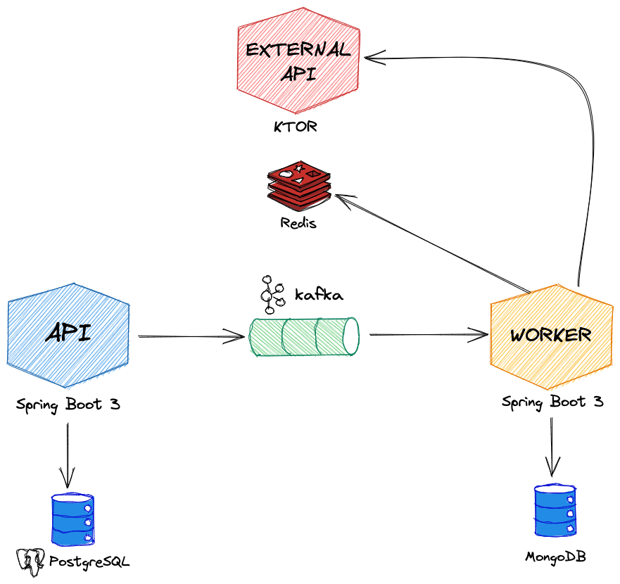

= Kotlin clean architecture

== Goals

The goal of this project is to practice with different technologies and tools within the Kotlin ecosystem, as well as to illustrate concepts of 'clean architecture'.

The project will consist of several interconnected services with differentiated responsibilities. Each of them may be built with different libraries or resources.

== Architecture

